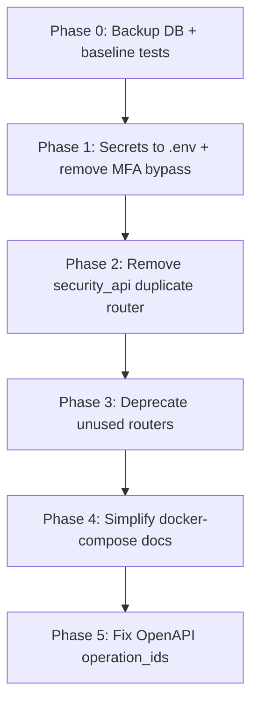

# LEAtTrace Architectural Analysis (Read-Only)

This is a **read-only audit** — no files were changed. The goal is to help you decide what is safe to clean up after moving from dummy to real local data.

---

## 1. What This Project Actually Is

**LEAtTrace** is a law-enforcement cybercrime forensics portal: case management, blockchain wallet tracing, evidence chain-of-custody, audit logging, SIEM-style alerts, and an AI investigation workspace.

### The real working stack

| Layer | What runs | Default |
|--------|-----------|---------|
| **Backend** | `backend/app/main.py` — single FastAPI monolith | SQLite (`leatrace.db`) |
| **Frontend** | `frontend/` — React + Vite + Zustand | Port 3000 |
| **Start path** | README + `make start` → `devops/scripts/start-all.ps1` | No Docker required |

The app is designed to **degrade gracefully**: if Neo4j, ClickHouse, Redis, Mongo, or Elasticsearch are unavailable, it falls back to NetworkX, SQLite, in-memory brokers, and simulated ES clients.

### What the frontend actually calls

From scanning all `fetch()` calls in `frontend/src`, the UI is wired to these backend routes:

| Area | Endpoints used |
|------|----------------|
| Auth | `/api/auth/login`, `/api/auth/mfa/verify` |
| Cases | `/api/cases` |
| Wallets | `/api/wallets/search`, `cluster`, `cross-chain-trace`, `mixer-check`, `defi`, `approvals`, `threats`, `fraud` |
| Evidence | `/api/evidence/*` |
| Audit | `/api/audit/logs`, `/api/audit/verify` |
| SIEM | `/api/siem/alerts`, `correlation`, `threat-intel/ioc-check` |
| Incident | `/api/incident/*` |
| AI | `/api/ai/chat` |
| Streaming | `ws://.../api/streaming/alerts` |

**Not used by the frontend at all:** `/api/soc/*`, `/api/correlation/*`, `/api/elasticsearch/*`, `/api/threat/*`, `/api/blockchain/risk/*`, most of `forensics_api` and `cluster_api`, and `iam_api` OIDC routes.

That gap matters: a large part of the backend is **API surface without UI consumers** — likely demo/enterprise scaffolding, not core product behavior.

---

## 2. Are the Heavy Configurations Needed?

### Short answer

**For local dev and the current UI: no.**  
**For a future production deployment at scale: some are useful, but most are optional today.**

### Clarification: there is no HashiCorp Vault

There is **no HashiCorp Vault server or `hvac` integration** in application code. “Vault” in this repo means:

- **Evidence vault** (file storage / chain-of-custody)
- **Cloud bucket names** in Terraform (`leatrace-evidence-vault-prod`, etc.)
- **DeFi “Yearn Vault”** references in blockchain decoders

Do not treat HashiCorp Vault as a dependency to remove — it was never wired in.

### Infrastructure inventory

| Service | In docker-compose? | Used in app code? | Fallback | Frontend uses it? |
|---------|-------------------|-------------------|----------|-------------------|
| **SQLite/Postgres** | Yes | Yes — primary DB | SQLite default | Yes |
| **Redis** | Yes | Sessions, pub/sub | In-memory | Indirectly (WebSocket broker) |
| **Neo4j** | Yes | `graph.py`, `neo4j_service.py` | NetworkX | **No** — UI uses `/api/wallets/*`, not `/api/graph` |
| **ClickHouse** | Yes | `clickhouse_service.py`, `blockchain_service.py` | SQLite | No |
| **Elasticsearch/ELK** | Yes | `elasticsearch_client.py` is **simulated in-process** | Mock client | No |
| **MongoDB** | No in root compose | Optional in `database.py` | Mock | No |
| **MinIO** | `docker/docker-compose.yml` only | Evidence object storage path | Local files | No |
| **Microservices** | `backend/leatrace-backend/` | Separate architecture | N/A | No |

### Two backends in one repo

1. **Monolith (active):** `backend/app/` — what README and CI use.
2. **Microservices (alternate):** `backend/leatrace-backend/` — gateway + 8 services, own compose/K8s.

Additionally, `real_ecosystem.py` exposes microservice-style routes (`/cpos/process`, `/riil/ingest`, etc.) **inside the monolith**, duplicating the alternate backend’s purpose.

### Are extras hurting the main goal?

**Yes, in these ways:**

1. **Cognitive load** — 22 routers, overlapping wallet/risk/threat/SOC/SIEM APIs.
2. **OpenAPI noise** — duplicate function names cause Operation ID conflicts in Swagger.
3. **False completeness** — README and compose suggest a full ELK/Neo4j/ClickHouse stack, but the app runs fine without them.
4. **Dead code risk** — `security_api.py`, `soc_api.py`, `iam_api.py`, and much of `forensics_api`/`cluster_api` look like parallel mock layers never connected to the UI.
5. **Dual architecture** — monolith + microservices + `real_ecosystem` creates three ways to do the same thing.

**They are not hurting runtime today** because fallbacks work and the frontend hits a narrow, consistent API set. The pain is mainly **maintainability, Swagger accuracy, and security hygiene** (hardcoded secrets, MFA bypass).

---

## 3. Duplicate Routes and Function Names

### 3A. Exact duplicate routes (critical — same method + path)

These are registered twice; **first registration wins at runtime** (`auth.router` is included before `security_api.router` in `main.py`):

| # | Route | Canonical (wins) | Duplicate (shadowed) |
|---|-------|------------------|----------------------|
| 1 | `POST /api/auth/mfa/verify` | `auth.py:144` — DB + JWT + TOTP | `security_api.py:28` — in-memory mock |
| 2 | `POST /api/auth/refresh` | `auth.py:228` — real token rotation | `security_api.py:48` — returns fake JWT strings |
| 3 | `GET /api/auth/sessions` | `auth.py:287` — DB sessions, auth required | `security_api.py:56` — static mock list, no auth |

```37:58:D:\LeatTrace-main\backend\app\main.py
app.include_router(auth.router)
// ...
app.include_router(security_api.router)
```

The duplicates in `security_api.py` are **effectively dead at runtime** but still pollute the route table and OpenAPI schema.

### 3B. Near-duplicates (same prefix, different paths — no runtime collision)

| Feature | Production path | Mock/alternate path |
|---------|-----------------|---------------------|
| MFA setup | `POST /api/auth/mfa/setup` (`auth.py`) | `POST /api/auth/mfa/enroll` (`security_api.py`) |
| Session revoke | `POST /api/auth/sessions/revoke/{session_id}` (`auth.py`) | `POST /api/auth/sessions/revoke` (`security_api.py`) |
| OAuth | `POST /api/auth/oauth/{provider}` (`auth.py`) | `POST /oauth/token` (`iam_api.py`, no `/api` prefix) |

### 3C. OpenAPI Operation ID conflicts (same Python function name)

FastAPI uses the function name as `operation_id` by default. Conflicts found:

| Function name | File A (path) | File B (path) | Same route? |
|---------------|---------------|---------------|-------------|
| `verify_mfa` | `auth.py` → `POST /api/auth/mfa/verify` | `security_api.py` → same | **Yes** |
| `get_active_sessions` | `auth.py` → `GET /api/auth/sessions` | `security_api.py` → same | **Yes** |
| `get_soc_alerts` | `soc_api.py` → `GET /api/soc/alerts` | `siem_correlation_api.py` → `GET /api/correlation/alerts` | No |
| `get_wallet_cluster` | `wallets.py` → `GET /api/wallets/cluster/{address}` | `cluster_api.py` → `GET /api/wallet/cluster` | No |
| `get_wallet_risk` | `forensics_api.py` → `GET /api/wallet/risk` | `blockchain_risk_api.py` → `GET /api/blockchain/risk/wallet/{address}` | No |
| `revoke_session` | `auth.py` → `POST /api/auth/sessions/revoke/{session_id}` | `iam_api.py` → `POST /auth/session/revoke` | No |

### 3D. Semantic overlap (different paths, same domain)

Multiple routers implement wallet risk, clustering, threat intel, and alerts:

```
wallets.py          → /api/wallets/cluster/{address}, /threats/{address}, /fraud/{address}
cluster_api.py      → /api/wallet/cluster, /threat/intelligence, /aml/analyze
forensics_api.py    → /api/wallet/risk, /threat/enrich
blockchain_risk_api → /api/blockchain/risk/wallet/{address}
soc_api.py          → /api/soc/alerts
siem.py             → /api/siem/alerts          ← frontend uses this
siem_correlation    → /api/correlation/alerts
```

The **frontend uses `wallets.py` and `siem.py`**, not the others.

### 3E. Unmounted router that would create future duplicates

`backend/app/ai_platform/prediction_router.py` is **not** included in `main.py`. If mounted alongside `ai_intelligence_api.py`, it would collide on `POST /api/ai/predict` and `POST /api/ai/train`.

### 3F. Frontend/backend path mismatch (bug, not duplicate)

`SettingsPage.tsx` calls `/api/health/indexer`, but `real_ecosystem.py` registers `/health/indexer` with **no `/api` prefix**. That call likely returns 404 today.

---

## 4. Hardcoded Secrets and Sensitive Configuration

**No `.env` or `.env.example` exists in the repo.** Root `.gitignore` does not exclude `.env`.

### Critical — fix before any production use

| Location | Issue | Recommendation |
|----------|-------|----------------|
| `backend/app/security.py:12` | JWT `SECRET_KEY` hardcoded | `JWT_SECRET` env var; fail startup if unset in prod |
| `backend/app/security.py:86` | MFA bypass: code `123456` always accepted | Remove or gate behind `LEATRACE_DEMO_DATA` only |
| `backend/app/oauth_server.py:10` | Hardcoded OAuth client secret | Move to env |
| `docker-compose.yml`, `docker/docker-compose.yml` | DB/Neo4j/MinIO passwords in plain text | Use `.env` + `${VAR}` references |
| `devops/terraform/*.tf` | RDS/Redis/Azure passwords hardcoded | TF variables + secret store; no committed defaults |

### High — demo credentials exposed

| Location | Issue |
|----------|-------|
| `backend/app/main.py:154–174` | Seeds users with `SecurePass@2026` when `LEATRACE_DEMO_DATA=true` |
| `frontend/src/pages/LoginPage.tsx:7–8` | Pre-filled email + password in login form |
| `frontend/src/pages/LoginPage.tsx`, `SettingsPage.tsx` | UI hints showing MFA bypass `123456` |
| `backend/app/neo4j_service.py:23` | Default `NEO4J_PASSWORD=SecurePass@2026` in code |

Since you replaced dummy data with real data locally, confirm:

- `LEATRACE_DEMO_DATA` is **not** set (defaults to `false` in `main.py`)
- Your real users/passwords live only in your local DB, not in seed code
- Login page pre-fill still shows old demo credentials — a UX/security leak even with real data

### Medium — configuration hygiene

| Issue | Files |
|-------|-------|
| Frontend hardcodes `http://127.0.0.1:8000` in 12+ files | All pages + `stores/index.ts` |
| `VITE_API_URL` documented in devops scripts but **not used** in frontend | `setup-vercel.ps1` vs actual TS code |
| Two compose files use **different password schemes** | Root vs `docker/docker-compose.yml` |
| Elasticsearch `xpack.security.enabled=false` | Both compose files |
| Microservices JWT/AES defaults | `leatrace-backend/config/settings.py`, `shared/utils.py` |

### Already good patterns

- `SIEM_ENDPOINT`, `SIEM_AUTH_TOKEN` from env (`siem_integrations.py`)
- `TRON_API_KEY`, `ETH_RPC_*` from env (`rpc_manager.py`)
- `AI_*` vars from env (`ai_platform/config.py`)
- `LEATRACE_*` prefix in `secret_manager.py` (local/env/file providers — no cloud Vault)

### Suggested `.env` structure (when you implement)

```bash
# Core
JWT_SECRET=<generate-with-openssl-rand-hex-32>
DATABASE_URL=sqlite:///./leatrace.db
LEATRACE_DEMO_DATA=false
LEATRACE_BACKGROUND_TASKS=false

# Auth
OAUTH_CLIENT_SECRET=<secret>

# Optional infra (only if running docker compose)
POSTGRES_PASSWORD=
NEO4J_PASSWORD=
REDIS_URL=redis://localhost:6379/0
CLICKHOUSE_HOST=localhost

# Blockchain
ETH_RPC_URL=
TRON_API_KEY=

# Frontend (frontend/.env)
VITE_API_URL=http://127.0.0.1:8000
VITE_WS_URL=ws://127.0.0.1:8000
```

---

## 5. Safe Step-by-Step Cleanup Plan

Do this in phases. **Do not skip backups or verification between phases.**

### Phase 0 — Baseline (no code changes yet)

1. **Back up your real data:** copy `backend/leatrace.db` (and any uploaded evidence files).
2. **Document current behavior:** hit `/docs`, log in, exercise Cases, Wallets, Evidence, SIEM, Audit pages.
3. **Export working API list** from Swagger and compare to the frontend table above.
4. **Confirm env flags:**
   - `LEATRACE_DEMO_DATA=false`
   - `LEATRACE_BACKGROUND_TASKS` only if you want live chain indexing
5. **Run tests:** `cd backend && pytest` — establish a green baseline.

### Phase 1 — Low-risk fixes (security + config, minimal behavior change)

| Step | Action | Risk |
|------|--------|------|
| 1.1 | Add `.env.example` + `.gitignore` entry for `.env` | None |
| 1.2 | Move `SECRET_KEY` to `JWT_SECRET` env in `security.py` | Low — set env before restart |
| 1.3 | Remove MFA `123456` bypass (or demo-only flag) | Medium — update your real MFA setup |
| 1.4 | Remove pre-filled credentials from `LoginPage.tsx` | None |
| 1.5 | Introduce `VITE_API_URL` in frontend (single config module) | Low |
| 1.6 | Fix SettingsPage path: `/api/health/indexer` → `/health/indexer` (or add `/api` prefix on backend) | Low |

### Phase 2 — Remove dead duplicate auth layer (highest-value cleanup)

**Target:** `security_api.py` overlapping `auth.py`

| Step | Action | Verification |
|------|--------|--------------|
| 2.1 | Grep codebase for `/api/auth/mfa/enroll`, `/sessions/revoke` (body-style) | Ensure nothing calls mock routes |
| 2.2 | **Option A (recommended):** Remove `security_api.router` from `main.py` | Re-test login, MFA, refresh, sessions |
| 2.2 alt | **Option B:** Keep file but change prefix to `/api/auth/mock` for dev demos | Swagger shows both clearly |
| 2.3 | Regenerate/check Swagger — `verify_mfa` and `get_active_sessions` conflicts should disappear | `/docs` |

**Why this is safe:** Frontend uses `auth.py` routes exclusively; mock routes in `security_api.py` are shadowed anyway.

### Phase 3 — Consolidate unused API surface (medium risk)

Do **not** delete yet — mark as deprecated first.

| Router group | Frontend usage | Recommended action |
|--------------|----------------|------------------|
| `security_api.py` | None (shadowed) | Remove from `main.py` (Phase 2) |
| `soc_api.py` | None — UI uses `siem.py` | Deprecate or merge into `siem.py` |
| `siem_correlation_api.py` | None | Keep if you plan attack-chain UI; else deprecate |
| `forensics_api.py`, `cluster_api.py` | None — UI uses `wallets.py` | Merge unique logic into `wallets.py` over time |
| `blockchain_risk_api.py` | None | Keep as advanced API or merge into wallets |
| `elasticsearch_api.py` | None (simulated client) | Keep for SIEM roadmap or move to `devops/` docs only |
| `iam_api.py` | None | Keep if OIDC is planned; else isolate under `/api/iam` |
| `real_ecosystem.py` | Settings indexer (broken path) | Fix path or remove if microservices unused |
| `leatrace-backend/` entire tree | Not used by default | Move to `archive/` or separate repo branch |

**Merge strategy for wallet/risk overlap:**

1. Keep **`wallets.py`** as the canonical API (frontend already uses it).
2. Port any unique logic from `cluster_api.py` / `forensics_api.py` into shared engines (`wallet_cluster_engine.py`, `risk_engine.py`).
3. Add `@deprecated` responses on old paths for one release cycle.
4. Remove old routers only after grep confirms zero callers.

### Phase 4 — Infrastructure simplification (optional)

| Goal | Action |
|------|--------|
| Simpler local dev | Create `docker-compose.dev.yml` with only Postgres + Redis (drop Neo4j, ClickHouse, ELK for daily work) |
| Keep full stack | Rename root compose to `docker-compose.full.yml`; document when each is needed |
| Microservices | Pick one: monolith **or** `leatrace-backend` — not both active in docs |
| Neo4j/ClickHouse | Keep code + fallbacks; only run containers when you need graph/analytics at scale |

### Phase 5 — OpenAPI hygiene (after route cleanup)

For remaining same-name functions across different paths:

```python
@router.get("/alerts", operation_id="get_correlation_alerts")
def get_soc_alerts(): ...
```

Or rename functions (`get_correlation_alerts`, `get_wallet_cluster_by_path`, etc.).

---

## 6. Recommended Priority Order



**Start with Phase 1 + Phase 2** — they fix real security issues and Swagger conflicts with minimal risk to your real data and working UI.

---

## 7. Bottom-Line Answers to Your Questions

| Question | Answer |
|----------|--------|
| **What is the core working purpose?** | A FastAPI + React forensics portal for case/evidence management, blockchain wallet tracing, audit logs, SIEM alerts, and AI-assisted investigation — running on SQLite by default with optional heavy infra. |
| **Do we need Vault, ClickHouse, Neo4j, etc.?** | **Not for current local dev or the existing UI.** They are optional scale-up paths with built-in fallbacks. HashiCorp Vault is not implemented. The extras add complexity more than they add current functionality. |
| **Duplicate routes/functions?** | **3 exact auth duplicates** (`security_api.py` vs `auth.py`); **6 Operation ID name collisions**; large semantic overlap across wallet/SOC/SIEM routers. |
| **Hardcoded secrets?** | JWT key, MFA bypass, demo passwords, docker/terraform credentials, OAuth secret, hardcoded API URLs — all should move to `.env`. |
| **Is cleanup safe?** | **Yes, if phased.** Back up `leatrace.db` first. Safest first cut: remove `security_api.router` (already shadowed). Do not bulk-delete `forensics_api`/`cluster_api` until you confirm no external consumers beyond the React app. |

---

When you are ready to proceed, a sensible first implementation pass would be: **`.env` setup + remove `security_api` registration + fix the Settings indexer path + strip demo credentials from the login page**. Say which phase you want to start with and we can do it carefully, one step at a time.