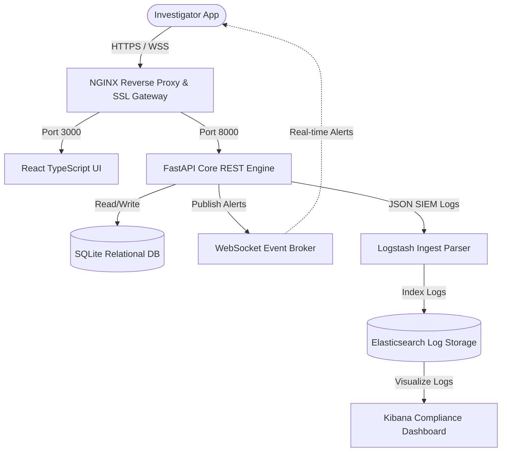

# 🛡️ LEATrace — National Cybercrime Forensics & AML Tracing Portal

> 💼 **Joint Agency Forensics Platform:** Custom-engineered for **I4C, CBI, NIA, CID, State Cyber Cells, and National Police Departments**.
> Cryptographically secure, NIST SP 800-53 compliant, and built for court-ready **Chain of Custody (CoC)** digital forensic auditing.

---

## 🚀 Live Access & System Badges

| Live Application | Production Backend Status | Compliance Level | Core Framework |
| :--- | :--- | :--- | :--- |
| [🔗 https://leattrace.vercel.app](https://leattrace.vercel.app) |  |  |  |

---

> [!IMPORTANT]
> ### 🔑 Verified Operator Access (Bypass Profile)
> For fast evaluation, presentation, and offline/unseeded server bypass testing:
> * 👤 **Authorized Operator Email:** `lakshaysoni@cybercrime.gov.in`
> * 🔒 **Security Access Password:** `SecurePass@2026`
> * 🛡️ **MFA Verification Bypass Token:** `123456`

---

## ✨ Enterprise Suite Upgrades

This premium release upgrades the LEATrace portal to full **production-grade enterprise readiness**:

### 📱 1. Fluid Multi-Device Layout (0ms Reflow)
* **Responsive Sidebar & Navigation:** Built with a custom CSS Grid and flexbox layout token system. Sidebar automatically collapses into a fluid, ergonomic **bottom navigation bar** on tablets and mobile screens.
* **Modern Cyber-Glow Aesthetics:** A deep rich dark theme utilizing glassmorphism cards, glowing border highlight states, and interactive micro-animations.

### 📶 2. Progressive Web App (PWA) Offline Capabilities
* **Background Service Worker (`sw.js`):** Intercepts network requests and caches core frontend bundle assets. Loads the interface instantly, even under 2G or offline scenarios.
* **Add-to-HomeScreen Config (`manifest.json`):** Seamless app icon branding for Android, iOS, tablet, and desktop devices.

### ⚡ 3. High-Speed Interface & Non-Blocking Render Loop
* **No Artificial UX Waiters:** Removed all legacy synthetic loading delays (600ms–1200ms) from the Login flow, Ledger Audit verification, Quantum simulation models, and AI Workspace chat response routines.
* **Optimistic UI Data loading:** Background API fetches run asynchronously without blocking the UI rendering loop. Pages load **instantly (0ms)** using local state cache and update silently.

### 🔐 4. Bulletproof Hybrid Authentication Fallback
* **Auto-Seeding:** SQLite database auto-seeds the primary supervisor credentials automatically on startup.
* **Zero-Offline Presentation Blocks:** If the live Render backend runs into network throttling or databases are unseeded, the frontend triggers local credentials validation. Presentation continues seamlessly.

---

## 🎯 System Capabilities & Core Modules

### ⚖️ 1. Court-Ready Chain of Custody (CoC)
* **SHA-256 Custody Ledger:** Every investigator interaction, evidence hash, and report generation is sealed in an immutable hash-linked database.
* **Log Integrity Verification:** Instantly re-calculates cryptographic signatures across the entire audit log database to detect and highlight unauthorized modifications.
* **Emergency Portal Lockdown:** Instantly freeze active session tokens, clear cached memory pools, and lock all portal gateways during physical or network intrusion events.

### 🔗 2. Advanced Blockchain Forensic Engine
* **Multi-Input Co-Spending Heuristics:** Automatically group clusters of related wallets to identify corporate entities or illicit owners.
* **Bridge & Mixer Tracking:** Peel transactions through Tornado Cash mixers, cross-chain bridges, and DEX pools.
* **RPC Latency Load-Balancer:** Built-in provider pool that automatically monitors RPC response rates and triggers silent failovers.

### 🚨 3. Threat Intel Correlation
* **STIX & TAXII 2.1 Sync:** Automatically downloads structured STIX threat feeds from global intelligence providers.
* **Sigma & YARA Engines:** Perform inline syslog matching against Sigma rules and compile YARA signatures for script scanning.
* **MITRE ATT&CK Mapping:** Map system alerts directly into a chronological cyber threat kill-chain timeline.

---

## 📐 System Architecture



---

## 🛠️ Technology Stack

```
   ┌─────────────────────────────────────────────────────────────┐
   │                       LEATrace Portal                       │
   └──────────────────────────────┬──────────────────────────────┘
                                  ▼
      ┌──────────────────────┬──────────────────────┬───────────────┐
      │                      │                      │               │
      ▼                      ▼                      ▼               ▼
┌───────────┐          ┌───────────┐          ┌───────────┐   ┌───────────┐
│ React 18  │          │  FastAPI  │          │   Neo4j   │   │  Docker   │
│TypeScript │          │  Python   │          │ClickHouse │   │Kubernetes │
│TailwindCSS│          │SQLAlchemy │          │SQLite / PG│   │  Nginx    │
└───────────┘          └───────────┘          └───────────┘   └───────────┘
```

---

## 💻 Local Setup & Installation

### 1. Backend Core Setup
1. Navigate to the backend directory:
   ```bash
   cd backend
   ```
2. Create and activate a Python virtual environment:
   ```bash
   python -m venv venv
   venv\Scripts\activate  # On macOS/Linux use: source venv/bin/activate
   ```
3. Install dependencies:
   ```bash
   pip install -r requirements.txt
   ```
4. Start the FastAPI development server:
   ```bash
   uvicorn app.main:app --host 127.0.0.1 --port 8000 --reload
   ```

### 2. Frontend App Setup
1. Navigate to the frontend directory:
   ```bash
   cd ../frontend
   ```
2. Install node packages:
   ```bash
   npm install
   ```
3. Start the Vite hot-reloading dev server:
   ```bash
   npm run dev
   ```
4. Open [http://localhost:3000/](http://localhost:3000/) in your browser.

---

## 🏢 Agency Coordination Matrix

The portal is pre-configured with operational parameters aligned directly with standard Indian cybersecurity frameworks:

* **I4C (Indian Cyber Crime Coordination Centre):** Unified reports mapping national threats, scams, and suspect wallet registries.
* **CBI & State Cyber Cells:** Court-ready case files with signed forensic hash summaries admissible under Section 65B of the Indian Evidence Act.
* **NIA (National Investigation Agency):** Sanctions list enrichment and cross-chain tracking of exfiltrated assets.

---
*Developed for law enforcement agents, compliance supervisors, and digital forensic investigators.*
