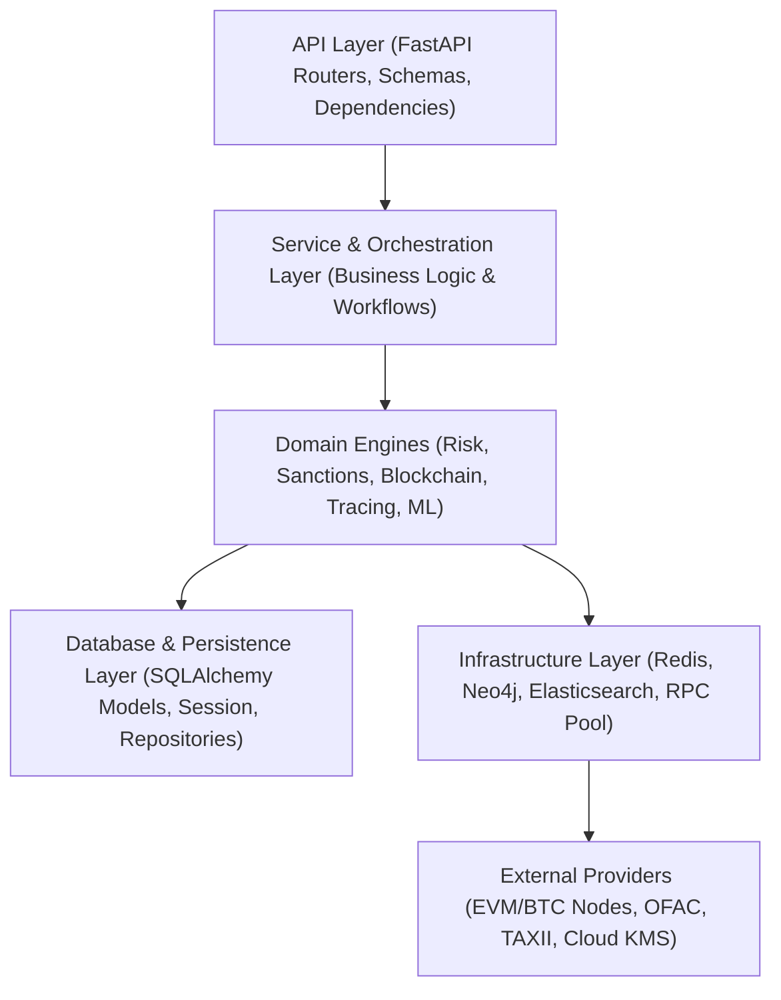

# LEATrace Backend Dependency Map & Architectural Flow

This document details the layered architectural dependencies of the LEATrace platform, ensuring unidirectional flow, clear boundaries, and zero circular couplings.

---

## 1. Architectural Layers & Dependency Direction



### Layer Rules:
1. **API → Services/Domain**: Routers must only validate incoming requests, check authentication/authorization, and delegate execution to the appropriate service or domain engine.
2. **Services → Domain / Repositories**: Orchestration services compose domain calculations and database transactions.
3. **Domain → Database**: Domain rules and calculations execute over database models and repositories without knowing about HTTP requests or routers.
4. **Infrastructure → External Providers**: Third-party APIs, RPC connections, and external clients are contained within the infrastructure layer using clean adapters.
5. **Forbidden Cross-Dependencies**:
   - Models must NEVER import routers or API schemas.
   - Domain logic must NEVER import FastAPI or request contexts.
   - Schemas must NEVER make database queries or external network requests.
   - Routers must NEVER import other routers.

---

## 2. Domain Dependency Details

### 2.1 Blockchain & Tracing Subsystem
```
app/api/v1/wallets.py, app/api/v1/graph.py
  │
  ▼
app/services/blockchain/blockchain_service.py
  ├── app/services/blockchain/fund_tracer.py (Taint propagation)
  ├── app/services/blockchain/mixer_detector.py (Mixer heuristics)
  ├── app/services/blockchain/bridge_detector.py (Cross-chain bridges)
  ├── app/services/blockchain/defi_decoder.py (Uniswap, Aave protocols)
  └── app/services/chains/registry.py (Chain provider pool)
        ├── app/services/chains/evm.py
        ├── app/services/chains/bitcoin.py
        ├── app/services/chains/solana.py
        └── app/infra/rpc_manager.py
              └── app/infra/rpc_cache.py (Redis/Memory cache)
```

### 2.2 Risk & Sanctions Subsystem
```
app/api/v1/sanctions.py, app/api/v1/blockchain_risk.py
  │
  ▼
app/services/risk/risk_engine.py
  ├── app/services/sanctions/screening_engine.py
  │     └── app/services/sanctions/providers/manager.py
  │           ├── OFAC SDN Provider (XML parse)
  │           ├── EU Consolidated Provider (XML parse)
  │           └── UN Sanctions Provider (XML parse)
  ├── app/services/risk/risk_patterns.py (Rules engine)
  ├── app/services/risk/confidence_engine.py (Statistical confidence)
  └── app/db/models/blockchain.py (RiskScore entity)
```

### 2.3 Threat Intelligence Subsystem
```
app/api/v1/threat_intel.py, app/api/v1/taxii.py, app/api/v1/cti.py
  │
  ▼
app/services/threat_intel/provider_manager.py
  ├── app/services/threat_intel/providers/taxii.py
  │     └── app/services/intel/taxii_client.py
  ├── app/services/threat_intel/providers/sanctions.py
  │     └── app/services/sanctions/screening_engine.py
  └── app/services/threat_intel/providers/mitre_attack.py
        └── app/services/intel/attack_engine.py
```

### 2.4 Security & IAM Subsystem
```
FastAPI Middleware Stack
  │
  ├── app/core/rbac.py (SecurityMiddleware, Role & Permission decorators)
  ├── app/core/security.py (JWT verify, bcrypt hashing, get_current_user)
  ├── app/core/mfa_engine.py (TOTP, WebAuthn)
  ├── app/core/oauth_server.py (OAuth2 authorization server)
  ├── app/core/encryption_engine.py (AES-256-GCM field encryption)
  └── app/db/models/user.py (User, Session, APIKey, SecurityPolicy)
```

---

## 3. Audit Findings & Resolution

| Issue Identified | Cause | Resolution |
| :--- | :--- | :--- |
| **SQLAlchemy Table Name Collision** | Models defined in both `app/sanctions/sanctions_models.py` and `app/services/sanctions/sanctions_models.py` | Consolidate onto single canonical definition in `app/services/sanctions/sanctions_models.py`. Delete duplicate. |
| **Test Import Path Mismatch** | `tests/test_elasticsearch.py` imported `app.infra.elasticsearch_client` | Point to canonical `app.infra.elasticsearch`. |
| **Non-Standard Pytest Execution** | `tests/test_phase1_modules.py` executed module-level script logic ending in `sys.exit(1)` | Wrap module checks inside standard pytest test functions. |
| **Dual Router Directories** | `app/routers/` (28 files) and `app/api/v1/` (29 files) existed concurrently | Standardize on `app/api/v1/` which is actively wired in `app/main.py`. Delete legacy `app/routers/`. |
| **Parallel Domain Packages** | Parallel folders in `app/blockchain`, `app/intel`, `app/risk`, `app/wallet` | Consolidate onto canonical `app/services/` subdirectories. Remove legacy parallel folders. |
