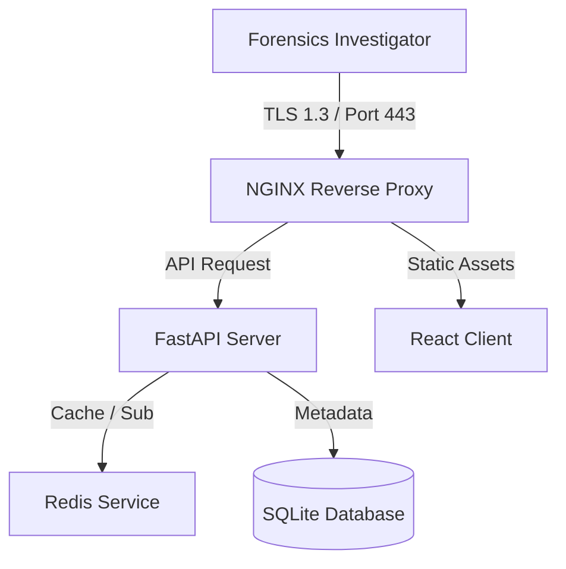

# LEATrace Operations Runbook & Operational Master Manual

This runbook defines standard system maintenance procedures, disaster recovery commands, and high-availability configuration setups.

---

## 🏗️ 1. Architecture Overview & Services



### 📦 Infrastructure Services List
* **Web Entryway**: NGINX Reverse Proxy Container.
* **Core API Stack**: FastAPI Python Uvicorn engine.
* **Static Assets**: React client compiled via Vite.
* **PubSub Broker**: Redis Server.

---

## 🚀 2. Deployments & Cluster Bootstrapping

### 🔧 2.1 Environmental variables
| Variable Name | Description | Default Value |
| :--- | :--- | :--- |
| `LEATRACE_DOMAIN` | Host domain name | `localhost` |
| `REDIS_URL` | Cache service endpoint | `redis://localhost:6379/0` |
| `DATABASE_URL` | SQLite path | `sqlite:///./sql_app.db` |

### 🛠️ 2.2 Local Cluster Launch Commands
To run the local cluster:
```powershell
# Run backend and frontend stacks in concurrent windows
make start
```

---

## 💾 3. Backups, Restore & Disaster Recovery

### 📁 3.1 Local database backup
To run database backups:
```powershell
# Triggers backup.ps1
powershell -ExecutionPolicy Bypass -File devops/scripts/backup.ps1
```

### 🔄 3.2 Restore database backup
To restore the database:
```powershell
# Triggers restore.ps1
powershell -ExecutionPolicy Bypass -File devops/scripts/restore.ps1
```
