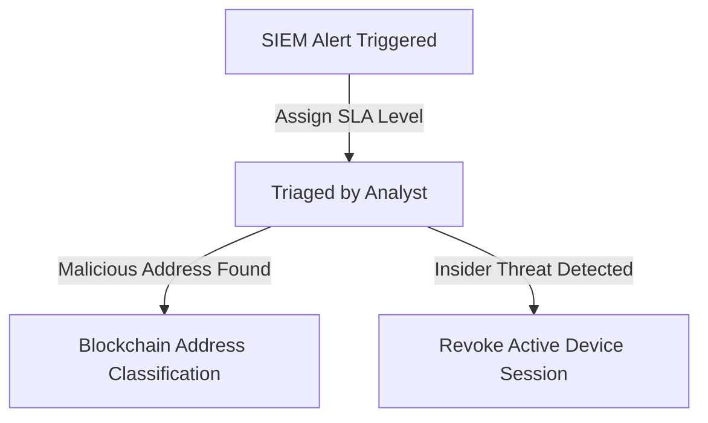

# LEATrace SOC Operations Manual

This document defines workflows for SOC Analysts, incident escalation metrics, and blockchain wallet investigations.

---

## 🖥️ 1. SOC Dashboard & Investigation Workflow

### 📊 SLA Severity Level Matrix
| Severity Level | Response SLA | Action Required |
| :--- | :--- | :--- |
| **Critical** | 15 Minutes | Contain immediately. Revoke JWT/OIDC active sessions. |
| **High** | 1 Hour | Run YARA file scans on evidence. |
| **Medium** | 4 Hours | Audit investigator RBAC permissions. |
| **Low** | 24 Hours | Document in daily report log. |

---

## 🔍 2. Blockchain Forensics Investigation Steps
1. **Classifier**: Input address into `/api/blockchain/classify` to detect BTC/EVM/SOL formats.
2. **OFAC Check**: Verify if the address is listed in the sanctioned entities list.
3. **Trace**: Search for mixer hashes and co-spending clusters.
4. **Export**: Capture Graph visualization and download Chain of Custody evidence PDF.
