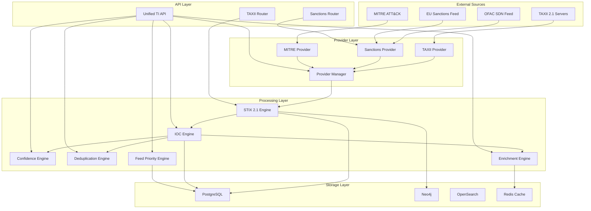
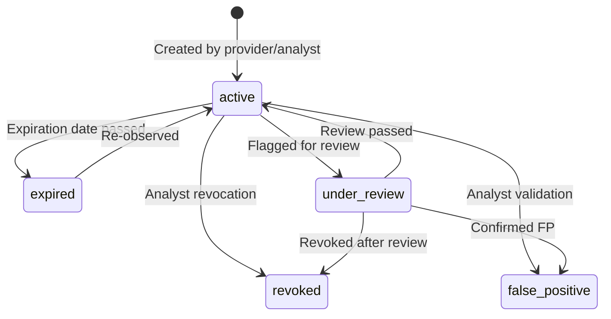

# LEATrace Threat Intelligence Architecture

## System Overview

LEATrace Enterprise Threat Intelligence Platform provides a multi-provider,
DB-backed threat intelligence system for lawful cyber investigation.

## Architecture



## Data Flow

### 1. Ingestion
```
External Source → Provider → STIX Engine → Validation → Normalization → DB Persistence
```

### 2. IOC Processing
```
STIX Object → IOC Extraction → Type Classification → Normalization →
Dedup Hash → DB Upsert → Confidence Scoring → Enrichment (async)
```

### 3. Query Flow
```
API Request → Auth/RBAC → IOC Engine → DB Query → Enrichment Cache → Response
```

## Component Reference

| Component | File | Purpose |
|-----------|------|---------|
| STIX Engine | `stix_engine.py` | STIX 2.1 factory, parser, validator for all 20 types |
| STIX Models | `stix_models.py` | SQLAlchemy models for STIX objects + IOC + TI provider |
| IOC Engine | `ioc_engine.py` | DB-backed IOC management with lifecycle and versioning |
| Confidence Engine | `confidence_engine.py` | 8-factor weighted confidence scoring |
| Dedup Engine | `deduplication_engine.py` | Hash + similarity-based duplicate detection |
| Enrichment Engine | `enrichment_engine.py` | 15-type IOC enrichment with caching |
| Feed Priority | `feed_priority_engine.py` | 7-factor provider ranking |
| Provider Manager | `threat_intel/provider_manager.py` | Multi-provider orchestration |
| TAXII Provider | `threat_intel/providers/taxii_provider.py` | TAXII 2.1 integration |
| Sanctions Provider | `threat_intel/providers/sanctions_provider.py` | OFAC/EU sanctions |
| MITRE Provider | `threat_intel/providers/mitre_attack_provider.py` | MITRE ATT&CK STIX |
| TI API | `routers/threat_intel_api.py` | Unified REST endpoints |

## IOC Types Supported

| Type | Example | Validation |
|------|---------|------------|
| `ip` | `192.168.1.1` | IPv4/IPv6 regex |
| `domain` | `evil.com` | FQDN regex |
| `url` | `https://evil.com/mal.exe` | URL scheme check |
| `hash_md5` | `d41d8cd9...` | 32-char hex |
| `hash_sha1` | `da39a3ee...` | 40-char hex |
| `hash_sha256` | `e3b0c442...` | 64-char hex |
| `email` | `user@evil.com` | Email regex |
| `cve` | `CVE-2024-12345` | CVE pattern |
| `attack_technique` | `T1059.001` | ATT&CK pattern |
| `wallet` | `0x1234...` | Blockchain address |
| `file` | filename | Free text |
| `registry` | `HKLM\...` | Free text |
| `mutex` | mutex name | Free text |
| `process` | process name | Free text |
| `certificate` | cert hash | Free text |
| `yara_rule` | rule reference | Free text |
| `sigma_rule` | rule reference | Free text |
| `cpe` | `cpe:2.3:...` | CPE pattern |
| `attack_group` | `G0001` | ATT&CK group pattern |

## IOC Lifecycle



## Confidence Scoring

| Component | Weight | Description |
|-----------|--------|-------------|
| Source Reputation | 20% | Provider trust level |
| Feed Quality | 15% | FP rate, update frequency |
| Observation Frequency | 15% | Number of sightings |
| Age Freshness | 10% | Exponential decay from last seen |
| False Positive Rate | 15% | Per-IOC FP tracking |
| Cross-Feed Correlation | 15% | Multiple sources reporting |
| Analyst Validation | 5% | Manual analyst input |
| Historical Accuracy | 5% | Provider true positive rate |

## Production Invariants

1. **No hardcoded IOCs** — All data from providers or analyst input
2. **No fabricated indicators** — Empty results when DB is empty
3. **No mock data** — Structured `not_configured` status when unavailable
4. **Full audit trail** — Every write operation logged
5. **RBAC enforced** — Role-based access on all endpoints
6. **Version history** — Every IOC change tracked
